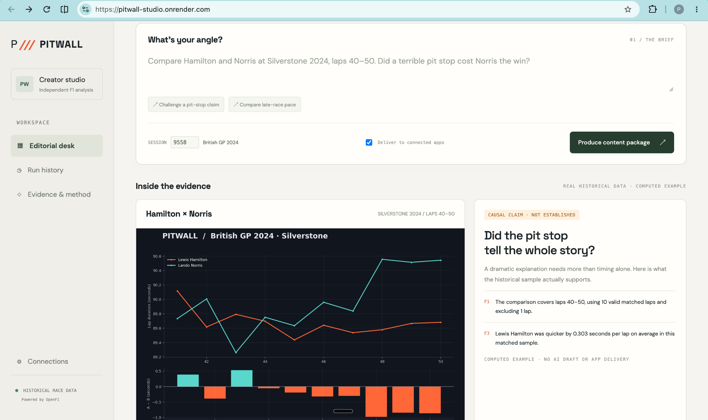
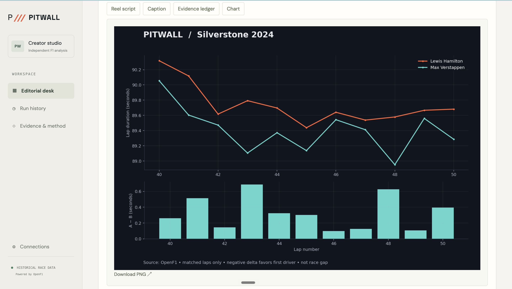
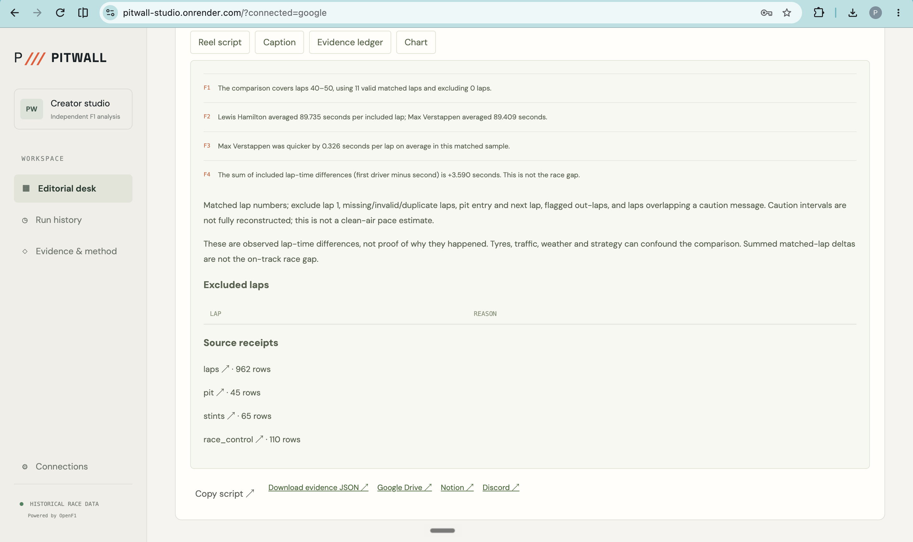
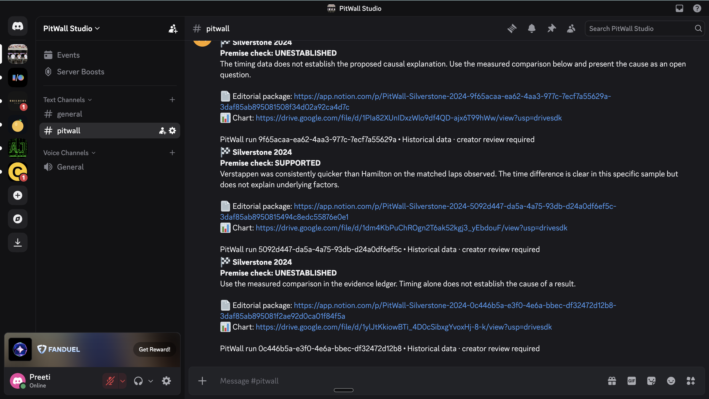
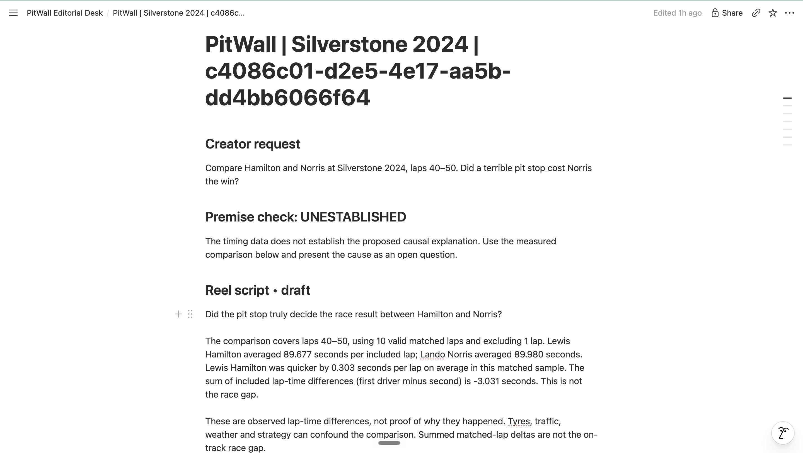

# PitWall

**Website:** [pitwall-studio.onrender.com](https://pitwall-studio.onrender.com/)











**Demo video Link:** (https://drive.google.com/file/d/1I4rKyHx2zdzyxZX__qRLXdSm8PD6oy6e/view?usp=sharing)

**Evidence before the edit.** An F1 research producer for sports creators.

A creator submits a race question in Discord or the hosted Studio. PitWall selects the comparison, retrieves historical race evidence, calculates timing differences, checks the premise, and produces a chart, a short reel-script draft, and a caption. It uploads the chart to Google Drive, creates the editorial package in Notion, and sends the completed package back to Discord.

The agent challenges causal stories the data cannot establish. A pit-lane duration is not stationary stop duration; a sum of matched-lap deltas is not the race gap.

## 1. Project overview

**Customer:** independent F1 creators and fan-community editors who need fast, traceable analysis before recording a take.

**Workflow:** brief → model-selected drivers/laps → OpenF1 retrieval → deterministic calculations → skeptical premise review → evidence-bound script assembly → PNG → Google Drive → Notion → Discord receipt.

The model chooses the research scope and editorial ordering. It does not execute arbitrary code, choose external destinations, or author numerical measurements. Factual script sentences come directly from computed evidence IDs. AI-written hooks, premise assessments and closing questions are labeled editorial text and still require creator review.

The public landing page includes a real, computed Silverstone 2024 example, explicitly labeled as historical and not an AI/delivery run. The authenticated dashboard shows actual job progress and delivery receipts.

**Pilot scope:** completed Race sessions available through OpenF1; two drivers; an explicit lap interval; matched-lap analysis. No live race feed, video generation, automated social publishing, or arbitrary causal attribution.

## 2. External apps used

| App | Read/action | Evidence of completion |
|---|---|---|
| Discord | Receive `/pitwall`; send editorial package links | Signature-verified request and returned message ID |
| Google Drive | Upload chart into the configured private output folder | Read back uploaded file ID and size |
| Notion | Create a child page containing script, caption, evidence and source URLs | Read back created page and URL |
| OpenF1 (data service) | Retrieve session, drivers, laps, pit-lane timing, stints and race-control messages | Source URLs, record counts, hashes and cache timestamps |
| OpenAI (model provider) | Select comparison and evaluate editorial premise | Model usage recorded per run |

Discord, Drive and Notion are the three external applications. OpenF1 is additional data infrastructure.

## 3. Setup instructions

### Deploy on Render

1. Fork this repository and connect it to Render.
2. Create an Environment Group named `pitwall-secrets`. Add the variables below. Never commit secrets.
3. Create a Blueprint from this repository's `render.yaml`. It provisions one Python web service and a Postgres database and attaches the existing group.
4. In the deployed service's Environment settings, copy its generated `ADMIN_PASSWORD`. Keep `SESSION_SECRET` stable: it encrypts the persisted Google credentials.
5. Open the public service URL and sign in to Studio with `ADMIN_PASSWORD`.
6. In Studio → Connections, copy the exact Google redirect URI. Add it to your Google OAuth Web application client. Add your Google account as a test user, enable Drive API, then click **Connect Google Drive** in Studio and authorize.
7. In the Discord Developer Portal, add Studio's displayed Interactions Endpoint URL. Save it, then click **Register /pitwall command** in Studio.
8. Click **Check connections**. Resolve any errors before submitting a full delivery run.
9. In your configured Discord channel, try `/pitwall brief: Compare Hamilton and Norris at Silverstone 2024, laps 40–50. Did a terrible pit stop cost Norris the win? session: 9558`.

No API key is needed for the bundled historical OpenF1 example. The configured runtime model defaults to `gpt-4.1-mini` and can be changed with `OPENAI_MODEL` to a compatible Chat Completions model available to your API project.

| Variable | Description |
|---|---|
| `DISCORD_BOT_TOKEN` | Bot token; keep secret |
| `DISCORD_APPLICATION_ID` | App ID |
| `DISCORD_PUBLIC_KEY` | Ed25519 request verification key |
| `DISCORD_GUILD_ID` | Only allowed server |
| `DISCORD_CHANNEL_ID` | Only allowed input/output channel |
| `GOOGLE_CLIENT_ID` / `GOOGLE_CLIENT_SECRET` | Google OAuth web client |
| `GOOGLE_DRIVE_FOLDER_ID` | Fixed, writable output folder |
| `NOTION_TOKEN` | Notion internal connection token |
| `NOTION_PARENT_PAGE_ID` | Parent page shared with that connection |
| `OPENAI_API_KEY` | Authorized key with available credit |

Generated by Blueprint: `ADMIN_PASSWORD`, `SESSION_SECRET`, `DATABASE_URL`. Optional: `OPENAI_MODEL`, `MAX_JOBS_PER_DAY` (default 30).

**Discord permissions:** Guild Install with `bot` and `applications.commands`; View Channels, Send Messages, Embed Links, Attach Files. Privileged intents are not required. Notion requires Read, Insert and Update content access to the parent page.

**Google access:** This single-user pilot requests the broad `drive` scope to access an existing folder. The application confines uploads to the configured folder; this is an application restriction, not a folder-scoped OAuth grant. Refresh credentials are encrypted in Postgres. A future multi-user version should use Google Picker with `drive.file`. Google OAuth Testing refresh tokens can expire; reconnect when needed.

### Run locally

```bash
python -m venv .venv
source .venv/bin/activate
pip install -r requirements.txt
# Set environment variables privately; do not commit them.
export ADMIN_PASSWORD='choose-a-local-password'
export SESSION_SECRET='choose-a-long-random-secret'
uvicorn app:app --port 8080
```

Open `http://localhost:8080`. Without `DATABASE_URL`, local development uses SQLite. Real Discord HTTP interactions require a public HTTPS deployment.

### Persistence and hosting limits

Postgres stores job checkpoints, source cache and encrypted Google refresh credentials. A Postgres advisory lock allows only one worker to execute across deploy overlap; use one Uvicorn process. Interrupted running jobs are queued on startup and reuse persisted calculation/content/delivery checkpoints.

The free Render web plan can sleep, which can delay webhooks and background execution. Free Postgres is a time-limited pilot resource. For continuous production operation, upgrade to always-on compute and a non-expiring database. This project is a deployed-pilot architecture, not a claim of production maturity or an availability SLA.

## 4. Reliability testing

Run:

```bash
python -m pytest -q --junitxml=evidence/test-results.xml
```

GitHub Actions runs this suite on pushes and pull requests and uploads its test report.

The suite covers:

- Independently specified numerical ground truth (synthetic lap fixture).
- Missing, null, non-finite and duplicate lap observations.
- Pit entry/out-lap exclusion and caution-message overlap.
- Insufficient evidence, invalid ranges and nonexistent drivers.
- Duplicate request IDs; one persisted job.
- Unauthorized dashboard calls and invalid Discord signatures.
- Valid signed Discord ping and rejection of a different channel.
- Simulated Notion failure after Drive success; reload state and resume without repeating Drive.
- Simulated Discord failure; never mark full delivery complete.
- Unknown evidence IDs stop delivery; numerical model wording is replaced with conservative text while computed evidence is retained.
- Conservative causal-claim override.
- Google credential encryption and invalid OAuth state rejection.
- Daily run limit.

**Test evidence:** `evidence/test-results.xml`. These are automated local tests with simulated external writes, not proof of successful live integration delivery. A real integration run must be verified in Studio using the returned Drive, Notion and Discord URLs. Do not infer a live pass rate from unit tests.

### Historical reproduction

`evidence/*-9558.json.gz` contains retrieved historical source snapshots with source URLs and capture timestamps. `evidence/example.json` is the deterministic output. `static/example.png` is its chart. To capture again, remove the specific snapshots you want refreshed and run:

```bash
PYTHONPATH=. python scripts/capture_example.py
```

OpenF1 calls are cached and rate-limited. Source hashes and record counts are attached to each run. The demo example is Hamilton versus Norris, Silverstone 2024, laps 40–50.

### Failure semantics and limits

Read requests use bounded retry/backoff. Non-idempotent writes are not blindly retried. Drive uses a persisted pre-generated file ID and read-back reconciliation. Notion searches for a run-specific child-page title before creating. An uncertain prior Notion create blocks automatic recreation if the page is not yet visible. Discord uses a nonce and records message IDs; an uncertain send blocks automatic resend. These choices prefer visible partial failure to duplicate artifacts. They are not a claim of distributed exactly-once delivery.

Caution-event filtering does not reconstruct full safety-car intervals; traffic, tyre life, fuel, weather and position remain confounders. Matched-lap averages are descriptive, not clean-air pace or causal estimates. Numerical guardrails replace model editorial fields containing digits with conservative, number-free wording; spelled-out numbers or other semantic mistakes still require review. The run history makes these limitations visible.

## Data attribution

Source: [OpenF1](https://openf1.org/), an independent community project. This hackathon pilot uses historical data for non-commercial research and fan engagement. Consult OpenF1 about appropriate licensing before commercializing. This project is not affiliated with or endorsed by Formula 1, FIA or any racing team.
